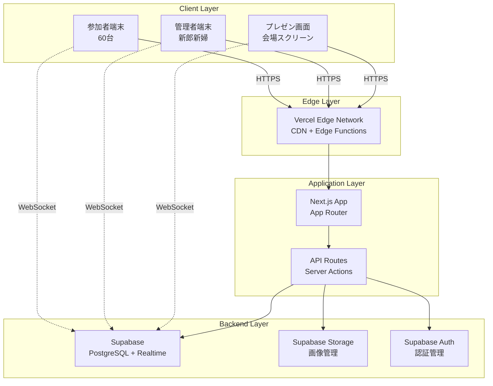
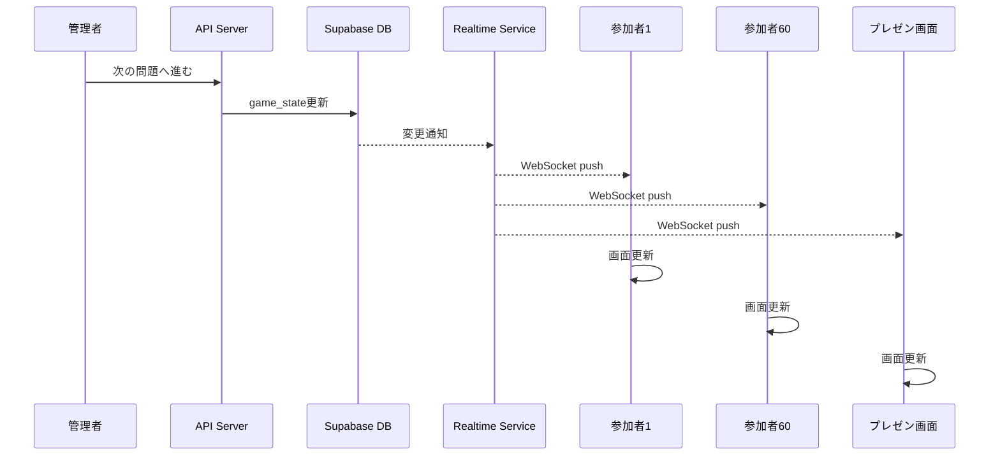
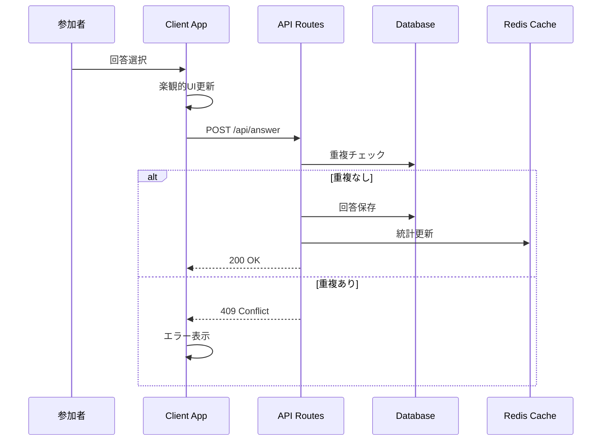
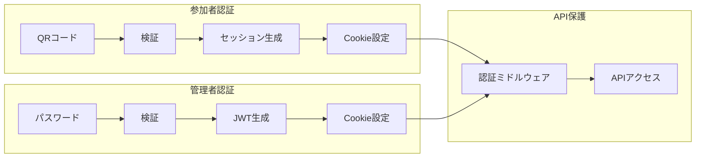
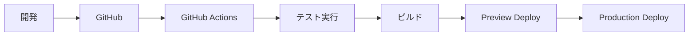

# アーキテクチャ設計書 - 結婚式クイズアプリ

## 1. システム全体アーキテクチャ

### 1.1 アーキテクチャ概要



### 1.2 レイヤー責務

| レイヤー | 責務 | 技術スタック |
|---------|------|-------------|
| **Client Layer** | ユーザーインターフェース、リアルタイム更新 | React, TypeScript, Tailwind CSS |
| **Edge Layer** | 静的配信、エッジ処理、キャッシング | Vercel Edge Network |
| **Application Layer** | ビジネスロジック、ルーティング、SSR/SSG | Next.js 14 (App Router) |
| **Backend Layer** | データ永続化、リアルタイム通信、認証 | Supabase (PostgreSQL + Realtime) |

## 2. データフロー設計

### 2.1 リアルタイム同期フロー



### 2.2 回答フロー



## 3. コンポーネント設計

### 3.1 フロントエンドアーキテクチャ

```
src/
├── app/                              # Next.js App Router
│   ├── (auth)/                       # 認証関連ページグループ
│   │   ├── login/
│   │   └── layout.tsx
│   ├── participant/                  # 参加者用ページ
│   │   ├── quiz/
│   │   │   ├── page.tsx
│   │   │   └── components/
│   │   └── layout.tsx
│   ├── admin/                        # 管理者用ページ
│   │   ├── dashboard/
│   │   ├── control/
│   │   └── layout.tsx
│   ├── presentation/                 # プレゼン画面
│   └── api/                          # API Routes
│       ├── auth/
│       ├── quiz/
│       └── admin/
├── components/                        # 共通コンポーネント
│   ├── ui/                          # shadcn/ui components
│   ├── quiz/                        # クイズ関連
│   └── realtime/                    # リアルタイム関連
├── hooks/                            # カスタムフック
│   ├── useGameState.ts
│   ├── useRealtimeSubscription.ts
│   └── useAuth.ts
├── lib/                              # ライブラリ・ユーティリティ
│   ├── supabase/
│   │   ├── client.ts
│   │   ├── server.ts
│   │   └── admin.ts
│   └── quiz/
│       ├── logic.ts
│       └── validation.ts
└── types/                            # TypeScript型定義
```

### 3.2 状態管理アーキテクチャ

```typescript
// グローバル状態管理
interface AppState {
  // ゲーム状態（Supabaseと同期）
  gameState: {
    currentQuestionId: string | null;
    status: GameStatus;
    lastAction: string | null;
  };
  
  // ユーザー状態（ローカル）
  user: {
    id: string;
    fullName: string;
    nickname: string | null;
    groupType: GroupType;
    score: number;
  };
  
  // UI状態（ローカル）
  ui: {
    isLoading: boolean;
    error: Error | null;
    connectionStatus: 'connected' | 'disconnected' | 'reconnecting';
  };
}

// リアルタイム同期Hook
function useRealtimeGameState() {
  const [gameState, setGameState] = useState<GameState>();
  
  useEffect(() => {
    const channel = supabase
      .channel('game_state')
      .on('postgres_changes', {
        event: '*',
        schema: 'public',
        table: 'game_state'
      }, (payload) => {
        setGameState(payload.new as GameState);
      })
      .subscribe();
      
    return () => {
      channel.unsubscribe();
    };
  }, []);
  
  return gameState;
}
```

## 4. API設計

### 4.1 RESTful API エンドポイント

| メソッド | パス | 説明 | 認証 |
|---------|------|------|------|
| POST | /api/auth/participant | 参加者ログイン | 不要 |
| POST | /api/auth/admin | 管理者ログイン | 不要 |
| GET | /api/quiz/current | 現在の問題取得 | 参加者 |
| POST | /api/quiz/answer | 回答送信 | 参加者 |
| GET | /api/quiz/ranking | ランキング取得 | 参加者 |
| POST | /api/admin/quiz/next | 次の問題へ | 管理者 |
| POST | /api/admin/quiz/close | 回答締切 | 管理者 |
| POST | /api/admin/quiz/reveal | 正解発表 | 管理者 |
| POST | /api/admin/quiz/undo | 操作取消 | 管理者 |

### 4.2 WebSocket チャンネル

```typescript
// Supabase Realtime Channels
const channels = {
  // ゲーム状態の同期
  gameState: 'game_state_changes',
  
  // 回答のリアルタイム集計
  answers: 'answers_updates',
  
  // ランキングの更新
  ranking: 'ranking_updates',
  
  // 管理者アクション通知
  adminActions: 'admin_actions'
};
```

## 5. セキュリティアーキテクチャ

### 5.1 認証・認可フロー



### 5.2 セキュリティ対策

| 脅威 | 対策 | 実装 |
|------|------|------|
| **不正アクセス** | 認証必須化 | NextAuth.js / Supabase Auth |
| **重複回答** | ユニーク制約 | Database制約 + アプリケーション検証 |
| **CSRF攻撃** | CSRFトークン | Next.js built-in protection |
| **XSS攻撃** | 入力値サニタイズ | React自動エスケープ + 検証 |
| **SQLインジェクション** | パラメータ化クエリ | Supabase ORM |
| **DDoS攻撃** | レート制限 | Vercel Edge Functions |

## 6. スケーラビリティ設計

### 6.1 負荷分散戦略

```yaml
# 想定負荷
同時接続数: 60
ピーク時リクエスト: 60 req/sec (全員同時回答)
データ転送量: 10MB/session

# スケーリング戦略
Frontend:
  - Vercel Edge Network による自動スケーリング
  - 静的アセットのCDN配信
  - ISR (Incremental Static Regeneration) 活用

Backend:
  - Supabase Connection Pooling (最大100接続)
  - Database Index最適化
  - Realtime Broadcasting (1対多配信)

Caching:
  - Edge Caching (静的コンテンツ)
  - Database Query Caching
  - Client-side State Caching
```

### 6.2 パフォーマンス最適化

```typescript
// 接続プーリング設定
const supabaseClient = createClient(
  process.env.NEXT_PUBLIC_SUPABASE_URL!,
  process.env.NEXT_PUBLIC_SUPABASE_ANON_KEY!,
  {
    realtime: {
      params: {
        eventsPerSecond: 10  // レート制限
      }
    },
    db: {
      schema: 'public'
    },
    auth: {
      persistSession: true,
      autoRefreshToken: true
    }
  }
);

// バッチ処理による最適化
async function batchAnswerProcessing(answers: Answer[]) {
  const batchSize = 10;
  const batches = chunk(answers, batchSize);
  
  for (const batch of batches) {
    await Promise.all(
      batch.map(answer => processAnswer(answer))
    );
  }
}
```

## 7. 障害対策

### 7.1 フォールバック戦略

```typescript
// 自動再接続ロジック
class RealtimeConnection {
  private retryCount = 0;
  private maxRetries = 5;
  private retryDelay = 1000;
  
  async connect() {
    try {
      await this.establishConnection();
      this.retryCount = 0;
    } catch (error) {
      if (this.retryCount < this.maxRetries) {
        this.retryCount++;
        await this.delay(this.retryDelay * this.retryCount);
        return this.connect();
      }
      throw new Error('接続に失敗しました');
    }
  }
  
  private delay(ms: number) {
    return new Promise(resolve => setTimeout(resolve, ms));
  }
}
```

### 7.2 データ整合性保証

```sql
-- トランザクション処理
BEGIN;
  -- 回答の重複チェック
  SELECT * FROM answers 
  WHERE user_id = $1 AND question_id = $2 
  FOR UPDATE;
  
  -- 存在しない場合のみ挿入
  INSERT INTO answers (user_id, question_id, choice_id)
  VALUES ($1, $2, $3)
  ON CONFLICT (user_id, question_id) DO NOTHING;
  
  -- 統計の更新
  UPDATE statistics 
  SET answer_count = answer_count + 1
  WHERE question_id = $2;
COMMIT;
```

## 8. モニタリング・運用設計

### 8.1 監視項目

| 項目 | 閾値 | アラート |
|------|------|---------|
| **同時接続数** | > 80 | Warning |
| **レスポンスタイム** | > 3秒 | Critical |
| **エラー率** | > 5% | Warning |
| **DB接続数** | > 90 | Critical |
| **メモリ使用率** | > 80% | Warning |

### 8.2 ログ設計

```typescript
// 構造化ログ
interface AppLog {
  timestamp: string;
  level: 'debug' | 'info' | 'warn' | 'error';
  category: 'auth' | 'quiz' | 'realtime' | 'api';
  userId?: string;
  action: string;
  metadata?: Record<string, any>;
  error?: {
    message: string;
    stack?: string;
  };
}

// ログ出力例
logger.info({
  category: 'quiz',
  userId: user.id,
  action: 'answer_submitted',
  metadata: {
    questionId: question.id,
    choiceId: choice.id,
    responseTime: 1234
  }
});
```

## 9. 開発・デプロイアーキテクチャ

### 9.1 CI/CDパイプライン



### 9.2 環境構成

| 環境 | 用途 | URL | インフラ |
|------|------|-----|---------|
| **Development** | 開発 | localhost:3000 | ローカル |
| **Preview** | レビュー | *.vercel.app | Vercel Preview |
| **Staging** | 検証 | staging.domain | Vercel + Supabase Dev |
| **Production** | 本番 | wedding-quiz.com | Vercel + Supabase Prod |

## 10. アーキテクチャ決定記録（ADR）

### ADR-001: Next.js App Router採用
- **決定**: App Routerを採用
- **理由**: Server Components、Streaming、並列データフェッチ
- **代替案**: Pages Router
- **影響**: 学習コスト増、パフォーマンス向上

### ADR-002: Supabase Realtime採用
- **決定**: Supabase Realtimeを採用
- **理由**: PostgreSQL統合、自動スケーリング、低レイテンシ
- **代替案**: Socket.io, Pusher
- **影響**: ベンダーロックイン、コスト削減

### ADR-003: Edge Functions使用
- **決定**: Vercel Edge Functionsを活用
- **理由**: 低レイテンシ、自動スケーリング、DDoS保護
- **代替案**: Node.js API Routes
- **影響**: コールドスタート削減、制限事項あり