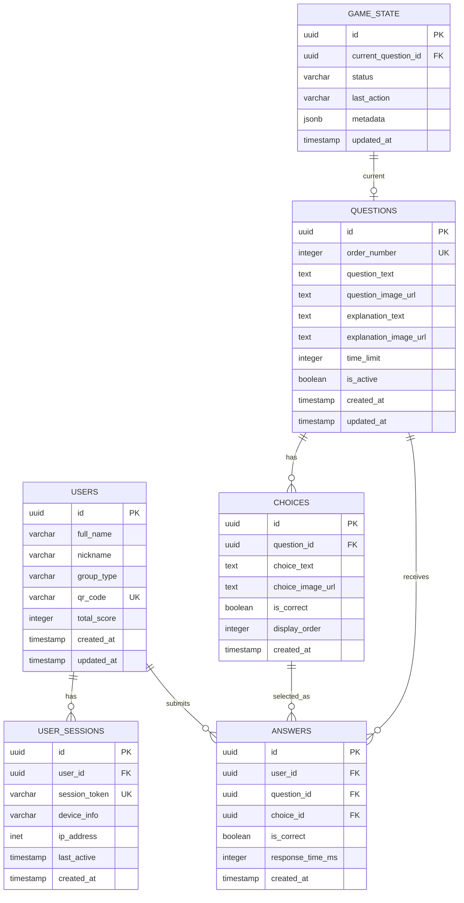

# データベース設計書 - 結婚式クイズアプリ

## 1. データベース概要

### 1.1 基本情報
- **DBMS**: PostgreSQL 15 (Supabase)
- **文字コード**: UTF-8
- **タイムゾーン**: Asia/Tokyo (JST)
- **命名規則**: snake_case
- **主キー**: UUID v4

### 1.2 設計方針
- 正規化レベル: 第3正規形を基本とし、パフォーマンスを考慮して一部非正規化
- インデックス戦略: 頻繁に検索される列、外部キー、ユニーク制約に設定
- パーティショニング: 不要（データ量が限定的）
- レプリケーション: Supabaseの自動バックアップを利用

## 2. ER図



## 3. テーブル定義

### 3.1 users（参加者）

```sql
CREATE TABLE users (
    id UUID PRIMARY KEY DEFAULT gen_random_uuid(),
    full_name VARCHAR(100) NOT NULL,
    nickname VARCHAR(20),
    group_type VARCHAR(20) NOT NULL,
    qr_code VARCHAR(50) UNIQUE NOT NULL,
    total_score INTEGER DEFAULT 0,
    created_at TIMESTAMP WITH TIME ZONE DEFAULT CURRENT_TIMESTAMP,
    updated_at TIMESTAMP WITH TIME ZONE DEFAULT CURRENT_TIMESTAMP,
    
    CONSTRAINT check_group_type CHECK (
        group_type IN ('新郎友人', '新郎親族', '新婦友人', '新婦親族')
    ),
    CONSTRAINT check_nickname_length CHECK (
        nickname IS NULL OR LENGTH(nickname) <= 20
    )
);

-- インデックス
CREATE INDEX idx_users_qr_code ON users(qr_code);
CREATE INDEX idx_users_group_type ON users(group_type);
CREATE INDEX idx_users_total_score ON users(total_score DESC);

-- トリガー: updated_at自動更新
CREATE TRIGGER update_users_updated_at
    BEFORE UPDATE ON users
    FOR EACH ROW
    EXECUTE FUNCTION update_updated_at_column();
```

### 3.2 user_sessions（セッション管理）

```sql
CREATE TABLE user_sessions (
    id UUID PRIMARY KEY DEFAULT gen_random_uuid(),
    user_id UUID NOT NULL REFERENCES users(id) ON DELETE CASCADE,
    session_token VARCHAR(100) UNIQUE NOT NULL,
    device_info TEXT,
    ip_address INET,
    last_active TIMESTAMP WITH TIME ZONE DEFAULT CURRENT_TIMESTAMP,
    created_at TIMESTAMP WITH TIME ZONE DEFAULT CURRENT_TIMESTAMP,
    
    CONSTRAINT check_session_token_length CHECK (
        LENGTH(session_token) >= 32
    )
);

-- インデックス
CREATE INDEX idx_user_sessions_user_id ON user_sessions(user_id);
CREATE INDEX idx_user_sessions_token ON user_sessions(session_token);
CREATE INDEX idx_user_sessions_last_active ON user_sessions(last_active);

-- 古いセッション自動削除（24時間経過）
CREATE OR REPLACE FUNCTION cleanup_old_sessions()
RETURNS void AS $$
BEGIN
    DELETE FROM user_sessions
    WHERE last_active < CURRENT_TIMESTAMP - INTERVAL '24 hours';
END;
$$ LANGUAGE plpgsql;
```

### 3.3 questions（問題）

```sql
CREATE TABLE questions (
    id UUID PRIMARY KEY DEFAULT gen_random_uuid(),
    order_number INTEGER UNIQUE NOT NULL,
    question_text TEXT NOT NULL,
    question_image_url TEXT,
    explanation_text TEXT,
    explanation_image_url TEXT,
    time_limit INTEGER DEFAULT 30,
    is_active BOOLEAN DEFAULT true,
    created_at TIMESTAMP WITH TIME ZONE DEFAULT CURRENT_TIMESTAMP,
    updated_at TIMESTAMP WITH TIME ZONE DEFAULT CURRENT_TIMESTAMP,
    
    CONSTRAINT check_order_number_positive CHECK (order_number > 0),
    CONSTRAINT check_time_limit CHECK (time_limit >= 10 AND time_limit <= 180)
);

-- インデックス
CREATE INDEX idx_questions_order ON questions(order_number);
CREATE INDEX idx_questions_active ON questions(is_active);
```

### 3.4 choices（選択肢）

```sql
CREATE TABLE choices (
    id UUID PRIMARY KEY DEFAULT gen_random_uuid(),
    question_id UUID NOT NULL REFERENCES questions(id) ON DELETE CASCADE,
    choice_text TEXT,
    choice_image_url TEXT,
    is_correct BOOLEAN DEFAULT false,
    display_order INTEGER NOT NULL,
    created_at TIMESTAMP WITH TIME ZONE DEFAULT CURRENT_TIMESTAMP,
    
    CONSTRAINT check_choice_content CHECK (
        choice_text IS NOT NULL OR choice_image_url IS NOT NULL
    ),
    CONSTRAINT unique_question_order UNIQUE (question_id, display_order)
);

-- インデックス
CREATE INDEX idx_choices_question ON choices(question_id);
CREATE INDEX idx_choices_correct ON choices(question_id, is_correct);
```

### 3.5 answers（回答）

```sql
CREATE TABLE answers (
    id UUID PRIMARY KEY DEFAULT gen_random_uuid(),
    user_id UUID NOT NULL REFERENCES users(id) ON DELETE CASCADE,
    question_id UUID NOT NULL REFERENCES questions(id) ON DELETE CASCADE,
    choice_id UUID NOT NULL REFERENCES choices(id) ON DELETE CASCADE,
    is_correct BOOLEAN NOT NULL,
    response_time_ms INTEGER,
    created_at TIMESTAMP WITH TIME ZONE DEFAULT CURRENT_TIMESTAMP,
    
    CONSTRAINT unique_user_question UNIQUE (user_id, question_id),
    CONSTRAINT check_response_time CHECK (
        response_time_ms IS NULL OR response_time_ms >= 0
    )
);

-- インデックス
CREATE INDEX idx_answers_user ON answers(user_id);
CREATE INDEX idx_answers_question ON answers(question_id);
CREATE INDEX idx_answers_correct ON answers(is_correct);
CREATE INDEX idx_answers_created ON answers(created_at);

-- トリガー: スコア自動更新
CREATE OR REPLACE FUNCTION update_user_score()
RETURNS TRIGGER AS $$
BEGIN
    IF NEW.is_correct THEN
        UPDATE users
        SET total_score = total_score + 1
        WHERE id = NEW.user_id;
    END IF;
    RETURN NEW;
END;
$$ LANGUAGE plpgsql;

CREATE TRIGGER trigger_update_score
    AFTER INSERT ON answers
    FOR EACH ROW
    EXECUTE FUNCTION update_user_score();
```

### 3.6 game_state（ゲーム状態）

```sql
CREATE TABLE game_state (
    id UUID PRIMARY KEY DEFAULT gen_random_uuid(),
    current_question_id UUID REFERENCES questions(id),
    status VARCHAR(30) NOT NULL,
    last_action VARCHAR(50),
    metadata JSONB DEFAULT '{}',
    updated_at TIMESTAMP WITH TIME ZONE DEFAULT CURRENT_TIMESTAMP,
    
    CONSTRAINT check_status CHECK (
        status IN (
            'waiting',           -- 待機中
            'question_display',  -- 問題表示中
            'accepting_answers', -- 回答受付中
            'closed',           -- 回答締切
            'showing_answer',   -- 正解発表中
            'showing_ranking',  -- ランキング表示中
            'finished'          -- 終了
        )
    )
);

-- 単一レコード制約（ゲーム状態は常に1つ）
CREATE UNIQUE INDEX idx_game_state_single ON game_state((true));

-- トリガー: updated_at自動更新
CREATE TRIGGER update_game_state_updated_at
    BEFORE UPDATE ON game_state
    FOR EACH ROW
    EXECUTE FUNCTION update_updated_at_column();
```

## 4. ビューとマテリアライズドビュー

### 4.1 v_user_rankings（ランキングビュー）

```sql
CREATE OR REPLACE VIEW v_user_rankings AS
SELECT 
    u.id,
    u.full_name,
    u.nickname,
    u.group_type,
    u.total_score,
    COUNT(DISTINCT a.question_id) as answered_count,
    RANK() OVER (ORDER BY u.total_score DESC, u.created_at ASC) as rank
FROM users u
LEFT JOIN answers a ON u.id = a.user_id
GROUP BY u.id, u.full_name, u.nickname, u.group_type, u.total_score, u.created_at
ORDER BY rank;
```

### 4.2 v_question_statistics（問題統計ビュー）

```sql
CREATE OR REPLACE VIEW v_question_statistics AS
SELECT 
    q.id,
    q.order_number,
    q.question_text,
    COUNT(DISTINCT a.user_id) as answer_count,
    SUM(CASE WHEN a.is_correct THEN 1 ELSE 0 END) as correct_count,
    ROUND(
        100.0 * SUM(CASE WHEN a.is_correct THEN 1 ELSE 0 END) / 
        NULLIF(COUNT(DISTINCT a.user_id), 0), 
        1
    ) as correct_rate,
    AVG(a.response_time_ms) as avg_response_time
FROM questions q
LEFT JOIN answers a ON q.id = a.question_id
GROUP BY q.id, q.order_number, q.question_text
ORDER BY q.order_number;
```

### 4.3 v_group_statistics（グループ統計ビュー）

```sql
CREATE OR REPLACE VIEW v_group_statistics AS
SELECT 
    group_type,
    COUNT(DISTINCT u.id) as member_count,
    AVG(u.total_score) as avg_score,
    MAX(u.total_score) as max_score,
    MIN(u.total_score) as min_score
FROM users u
GROUP BY group_type;
```

## 5. ストアドプロシージャ

### 5.1 sp_submit_answer（回答送信）

```sql
CREATE OR REPLACE FUNCTION sp_submit_answer(
    p_user_id UUID,
    p_question_id UUID,
    p_choice_id UUID
)
RETURNS TABLE(
    success BOOLEAN,
    message TEXT,
    is_correct BOOLEAN
) AS $$
DECLARE
    v_is_correct BOOLEAN;
    v_existing_answer UUID;
BEGIN
    -- 既存回答チェック
    SELECT id INTO v_existing_answer
    FROM answers
    WHERE user_id = p_user_id AND question_id = p_question_id;
    
    IF v_existing_answer IS NOT NULL THEN
        RETURN QUERY
        SELECT false, '既に回答済みです', false::boolean;
        RETURN;
    END IF;
    
    -- 正解判定
    SELECT c.is_correct INTO v_is_correct
    FROM choices c
    WHERE c.id = p_choice_id;
    
    -- 回答挿入
    INSERT INTO answers (user_id, question_id, choice_id, is_correct)
    VALUES (p_user_id, p_question_id, p_choice_id, v_is_correct);
    
    RETURN QUERY
    SELECT true, '回答を受け付けました', v_is_correct;
END;
$$ LANGUAGE plpgsql;
```

### 5.2 sp_reset_game（ゲームリセット）

```sql
CREATE OR REPLACE FUNCTION sp_reset_game()
RETURNS void AS $$
BEGIN
    -- トランザクション開始
    -- 回答データ削除
    DELETE FROM answers;
    
    -- ユーザースコアリセット
    UPDATE users SET total_score = 0;
    
    -- セッション削除
    DELETE FROM user_sessions;
    
    -- ゲーム状態初期化
    UPDATE game_state 
    SET 
        current_question_id = NULL,
        status = 'waiting',
        last_action = 'reset',
        metadata = '{}',
        updated_at = CURRENT_TIMESTAMP;
END;
$$ LANGUAGE plpgsql;
```

### 5.3 sp_undo_last_action（UNDO処理）

```sql
CREATE OR REPLACE FUNCTION sp_undo_last_action()
RETURNS TABLE(
    success BOOLEAN,
    message TEXT,
    new_status VARCHAR
) AS $$
DECLARE
    v_last_action VARCHAR;
    v_current_status VARCHAR;
    v_new_status VARCHAR;
BEGIN
    -- 現在の状態取得
    SELECT last_action, status 
    INTO v_last_action, v_current_status
    FROM game_state
    LIMIT 1;
    
    -- アクションに応じた処理
    CASE v_last_action
        WHEN 'close_answers' THEN
            v_new_status := 'accepting_answers';
        WHEN 'show_answer' THEN
            v_new_status := 'closed';
        WHEN 'next_question' THEN
            -- 前の問題に戻る処理
            v_new_status := 'showing_answer';
        ELSE
            RETURN QUERY
            SELECT false, '取り消し可能な操作がありません', v_current_status;
            RETURN;
    END CASE;
    
    -- 状態更新
    UPDATE game_state
    SET 
        status = v_new_status,
        last_action = 'undo_' || v_last_action,
        updated_at = CURRENT_TIMESTAMP;
    
    RETURN QUERY
    SELECT true, '操作を取り消しました', v_new_status;
END;
$$ LANGUAGE plpgsql;
```

## 6. インデックス戦略

### 6.1 インデックス一覧

| テーブル | インデックス名 | 列 | 種類 | 用途 |
|---------|---------------|-----|------|------|
| users | idx_users_qr_code | qr_code | B-tree | QRコード検索 |
| users | idx_users_group_type | group_type | B-tree | グループ別集計 |
| users | idx_users_total_score | total_score DESC | B-tree | ランキング |
| answers | idx_answers_user_question | user_id, question_id | Unique | 重複防止 |
| answers | idx_answers_created | created_at | B-tree | 時系列検索 |

### 6.2 パフォーマンスチューニング

```sql
-- 統計情報の更新
ANALYZE users;
ANALYZE answers;
ANALYZE questions;

-- クエリプラン確認
EXPLAIN (ANALYZE, BUFFERS) 
SELECT * FROM v_user_rankings 
WHERE group_type = '新郎友人';

-- インデックス使用状況確認
SELECT 
    schemaname,
    tablename,
    indexname,
    idx_scan,
    idx_tup_read,
    idx_tup_fetch
FROM pg_stat_user_indexes
ORDER BY idx_scan DESC;
```

## 7. セキュリティ設定

### 7.1 Row Level Security (RLS)

```sql
-- RLS有効化
ALTER TABLE users ENABLE ROW LEVEL SECURITY;
ALTER TABLE answers ENABLE ROW LEVEL SECURITY;
ALTER TABLE user_sessions ENABLE ROW LEVEL SECURITY;

-- ポリシー設定: 参加者は自分のデータのみ参照可能
CREATE POLICY users_select_own ON users
    FOR SELECT
    USING (auth.uid()::text = id::text);

-- ポリシー設定: 回答は自分のもののみ挿入可能
CREATE POLICY answers_insert_own ON answers
    FOR INSERT
    WITH CHECK (auth.uid()::text = user_id::text);

-- 管理者用ポリシー
CREATE POLICY admin_all ON users
    FOR ALL
    USING (auth.jwt() ->> 'role' = 'admin');
```

### 7.2 アクセス権限

```sql
-- ロール作成
CREATE ROLE quiz_participant;
CREATE ROLE quiz_admin;

-- 参加者権限
GRANT SELECT ON users TO quiz_participant;
GRANT SELECT, INSERT ON answers TO quiz_participant;
GRANT SELECT ON questions, choices TO quiz_participant;
GRANT SELECT ON v_user_rankings TO quiz_participant;

-- 管理者権限
GRANT ALL ON ALL TABLES IN SCHEMA public TO quiz_admin;
GRANT EXECUTE ON ALL FUNCTIONS IN SCHEMA public TO quiz_admin;
```

## 8. バックアップ・リカバリ

### 8.1 バックアップ戦略

```sql
-- 自動バックアップ設定（Supabase管理）
-- 日次バックアップ: 7日間保持
-- Point-in-Time Recovery: 有効

-- 手動バックアップスクリプト
pg_dump -h db.supabase.co -U postgres -d wedding_quiz \
    --schema=public \
    --no-owner \
    --no-privileges \
    -f backup_$(date +%Y%m%d_%H%M%S).sql
```

### 8.2 リストア手順

```sql
-- データリストア
psql -h db.supabase.co -U postgres -d wedding_quiz < backup.sql

-- 整合性チェック
SELECT 
    'users' as table_name, COUNT(*) as count FROM users
UNION ALL
SELECT 'questions', COUNT(*) FROM questions
UNION ALL
SELECT 'answers', COUNT(*) FROM answers;
```

## 9. マイグレーション管理

### 9.1 マイグレーションファイル構造

```
supabase/migrations/
├── 20240101000001_create_users_table.sql
├── 20240101000002_create_questions_table.sql
├── 20240101000003_create_answers_table.sql
├── 20240101000004_create_game_state_table.sql
├── 20240101000005_create_views.sql
└── 20240101000006_create_functions.sql
```

### 9.2 マイグレーション実行

```bash
# マイグレーション作成
supabase migration new create_initial_schema

# ローカル実行
supabase db reset

# 本番適用
supabase db push
```

## 10. 監視・メンテナンス

### 10.1 監視クエリ

```sql
-- 接続数監視
SELECT 
    datname,
    numbackends as connection_count,
    pg_database_size(datname) as db_size
FROM pg_stat_database
WHERE datname = 'wedding_quiz';

-- スロークエリ検出
SELECT 
    query,
    calls,
    mean_exec_time,
    total_exec_time
FROM pg_stat_statements
WHERE mean_exec_time > 1000
ORDER BY mean_exec_time DESC
LIMIT 10;

-- テーブルサイズ確認
SELECT 
    schemaname,
    tablename,
    pg_size_pretty(pg_total_relation_size(schemaname||'.'||tablename)) as size
FROM pg_tables
WHERE schemaname = 'public'
ORDER BY pg_total_relation_size(schemaname||'.'||tablename) DESC;
```

### 10.2 定期メンテナンス

```sql
-- VACUUM実行（週次）
VACUUM ANALYZE users;
VACUUM ANALYZE answers;
VACUUM ANALYZE questions;

-- インデックス再構築（月次）
REINDEX TABLE users;
REINDEX TABLE answers;

-- 統計情報更新
ANALYZE;
```