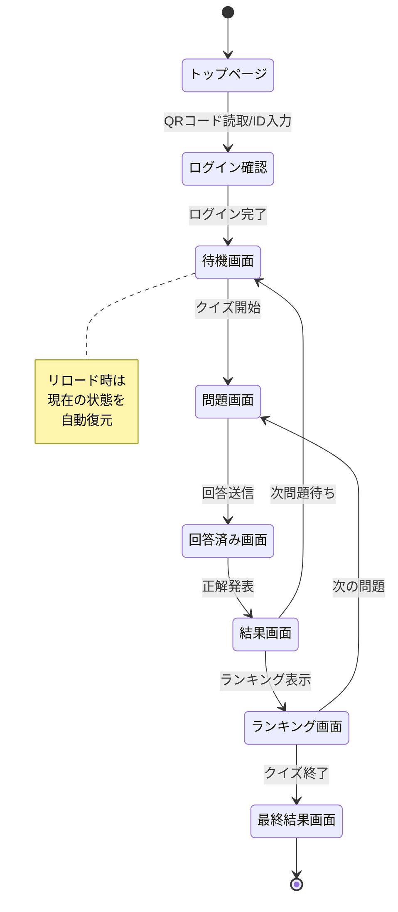
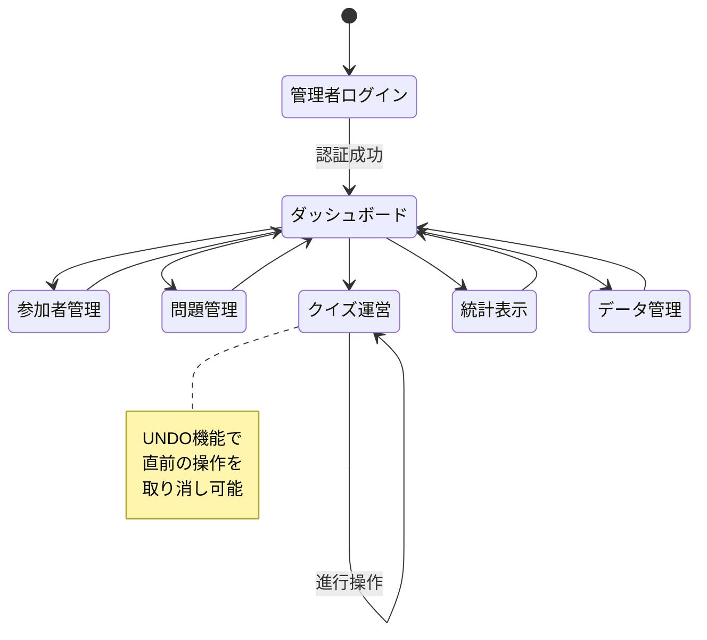

# 画面遷移設計書 - 結婚式クイズアプリ

## 1. 画面一覧

### 1.1 参加者用画面

| 画面ID | 画面名 | パス | 説明 |
|--------|--------|------|------|
| P-001 | トップページ | `/` | QRコード読み取り/ID入力 |
| P-002 | ログイン確認 | `/participant/login` | 名前確認・ニックネーム設定 |
| P-003 | 待機画面 | `/participant/waiting` | クイズ開始待ち |
| P-004 | 問題画面 | `/participant/quiz` | 問題表示・回答選択 |
| P-005 | 回答済み画面 | `/participant/answered` | 回答送信後の待機 |
| P-006 | 結果画面 | `/participant/result` | 正解/不正解表示 |
| P-007 | ランキング画面 | `/participant/ranking` | 全体順位表示 |
| P-008 | 最終結果画面 | `/participant/final` | 最終順位・統計 |

### 1.2 管理者用画面

| 画面ID | 画面名 | パス | 説明 |
|--------|--------|------|------|
| A-001 | 管理者ログイン | `/admin/login` | パスワード認証 |
| A-002 | ダッシュボード | `/admin/dashboard` | 管理メニュー |
| A-003 | 参加者管理 | `/admin/users` | 参加者登録・QR生成 |
| A-004 | 問題管理 | `/admin/questions` | 問題作成・編集 |
| A-005 | クイズ運営 | `/admin/control` | 進行コントロール |
| A-006 | 統計表示 | `/admin/statistics` | リアルタイム統計 |
| A-007 | データ管理 | `/admin/data` | リセット・エクスポート |

### 1.3 プレゼンテーション画面

| 画面ID | 画面名 | パス | 説明 |
|--------|--------|------|------|
| S-001 | 待機表示 | `/presentation` | 開始前/問題間の表示 |
| S-002 | 問題表示 | `/presentation` | 問題文と選択肢 |
| S-003 | 集計中表示 | `/presentation` | 回答集計アニメーション |
| S-004 | 正解発表 | `/presentation` | 正解と解説表示 |
| S-005 | ランキング表示 | `/presentation` | 途中経過/最終順位 |

## 2. 画面遷移フロー

### 2.1 参加者フロー



### 2.2 管理者フロー



## 3. 画面詳細設計

### 3.1 P-001: トップページ

```typescript
// コンポーネント構成
interface TopPageProps {
  onQRCodeScan: (code: string) => void;
  onManualInput: (code: string) => void;
}

// 画面要素
- ヘッダー: アプリタイトル「Wedding Quiz」
- メインエリア:
  - QRコードリーダー（カメラ権限要求）
  - 手動入力フォーム（代替手段）
  - 使い方説明テキスト
- フッター: 著作権表示

// 画面遷移条件
- QRコード読取成功 → P-002へ
- 手動入力完了 → P-002へ
- エラー時 → エラーメッセージ表示

// レイアウト
<div className="min-h-screen flex flex-col">
  <header className="bg-pink-100 p-4">
    <h1 className="text-2xl font-bold text-center">Wedding Quiz</h1>
  </header>
  
  <main className="flex-1 p-4">
    <div className="max-w-md mx-auto">
      <QRCodeReader onScan={handleScan} />
      
      <div className="mt-8 text-center">
        <p className="text-gray-600 mb-4">またはIDを入力</p>
        <input 
          type="text" 
          className="border rounded px-4 py-2"
          placeholder="ID入力"
        />
        <button className="ml-2 bg-blue-500 text-white px-4 py-2 rounded">
          参加
        </button>
      </div>
    </div>
  </main>
</div>
```

### 3.2 P-002: ログイン確認画面

```typescript
// 状態管理
interface LoginConfirmState {
  user: {
    fullName: string;
    groupType: string;
    currentNickname: string | null;
  };
  nicknameInput: string;
  isValidating: boolean;
  error: string | null;
}

// 画面要素
- ユーザー情報表示
  - フルネーム（編集不可）
  - グループ（新郎友人/新郎親族/新婦友人/新婦親族）
- ニックネーム設定
  - 入力フィールド（最大20文字）
  - バリデーションメッセージ
- 確定ボタン

// バリデーション
- 文字数制限（20文字以内）
- 絵文字禁止
- 重複チェック（リアルタイム）
```

### 3.3 P-004: 問題画面

```typescript
// 問題表示コンポーネント
interface QuizQuestionProps {
  question: {
    id: string;
    text: string;
    imageUrl?: string;
    choices: Choice[];
    timeLimit: number;
  };
  onAnswer: (choiceId: string) => void;
  isAnswering: boolean;
}

// レイアウト構成
<div className="p-4">
  {/* 問題番号 */}
  <div className="text-center mb-4">
    <span className="text-lg font-bold">第{questionNumber}問</span>
  </div>
  
  {/* 問題文 */}
  <div className="bg-white rounded-lg shadow p-6 mb-6">
    {question.imageUrl && (
      
    )}
    <p className="text-lg">{question.text}</p>
  </div>
  
  {/* 選択肢 */}
  <div className="space-y-3">
    {choices.map((choice) => (
      <button
        key={choice.id}
        onClick={() => onAnswer(choice.id)}
        className="w-full p-4 bg-white rounded-lg shadow hover:bg-blue-50"
        disabled={isAnswering}
      >
        {choice.imageUrl ? (
          
        ) : (
          <span className="text-lg">{choice.text}</span>
        )}
      </button>
    ))}
  </div>
</div>
```

### 3.4 A-005: クイズ運営画面

```typescript
// 運営コントロールパネル
interface QuizControlPanelProps {
  gameState: GameState;
  currentQuestion: Question | null;
  statistics: Statistics;
  onAction: (action: ControlAction) => void;
  onUndo: () => void;
}

// 画面構成
<div className="grid grid-cols-12 gap-4 h-screen p-4">
  {/* 左側: 状態表示 */}
  <div className="col-span-4 bg-gray-100 rounded p-4">
    <h2 className="text-xl font-bold mb-4">現在の状態</h2>
    <StatusDisplay state={gameState} />
    <QuestionInfo question={currentQuestion} />
  </div>
  
  {/* 中央: コントロール */}
  <div className="col-span-4 bg-white rounded p-4">
    <h2 className="text-xl font-bold mb-4">進行コントロール</h2>
    <div className="space-y-4">
      <ActionButton 
        action="start" 
        label="クイズ開始"
        disabled={gameState.status !== 'waiting'}
      />
      <ActionButton 
        action="close" 
        label="回答締切"
        disabled={gameState.status !== 'accepting_answers'}
      />
      <ActionButton 
        action="reveal" 
        label="正解発表"
        disabled={gameState.status !== 'closed'}
      />
      <ActionButton 
        action="next" 
        label="次の問題へ"
        disabled={gameState.status !== 'showing_answer'}
      />
      
      <div className="border-t pt-4">
        <button 
          onClick={onUndo}
          className="w-full bg-yellow-500 text-white p-3 rounded"
        >
          ↩️ 直前の操作を取り消す
        </button>
      </div>
    </div>
  </div>
  
  {/* 右側: 統計 */}
  <div className="col-span-4 bg-gray-100 rounded p-4">
    <h2 className="text-xl font-bold mb-4">リアルタイム統計</h2>
    <StatisticsDisplay statistics={statistics} />
  </div>
</div>
```

### 3.5 S-004: 正解発表画面（プレゼンテーション）

```typescript
// プレゼンテーション画面構成
interface AnswerRevealProps {
  question: Question;
  choices: Choice[];
  statistics: AnswerStatistics;
  showExplanation: boolean;
}

// アニメーション付き表示
<div className="h-screen bg-gradient-to-b from-blue-100 to-pink-100 p-8">
  {/* 問題再表示 */}
  <div className="text-center mb-8">
    <h2 className="text-4xl font-bold mb-4">第{questionNumber}問</h2>
    <p className="text-2xl">{question.text}</p>
  </div>
  
  {/* 選択肢と回答分布 */}
  <div className="grid grid-cols-2 gap-8 mb-8">
    {choices.map((choice) => (
      <motion.div
        key={choice.id}
        initial={{ opacity: 0 }}
        animate={{ opacity: 1 }}
        className={`p-6 rounded-lg ${
          choice.isCorrect ? 'bg-green-200 border-4 border-green-500' : 'bg-white'
        }`}
      >
        <div className="text-xl mb-2">{choice.text}</div>
        <div className="text-3xl font-bold">
          {statistics.choiceCount[choice.id]}人
        </div>
        <div className="text-lg text-gray-600">
          ({statistics.choicePercentage[choice.id]}%)
        </div>
      </motion.div>
    ))}
  </div>
  
  {/* 解説 */}
  {showExplanation && (
    <motion.div 
      initial={{ y: 100, opacity: 0 }}
      animate={{ y: 0, opacity: 1 }}
      className="bg-white rounded-lg p-6"
    >
      <h3 className="text-2xl font-bold mb-4">解説</h3>
      {question.explanationImageUrl && (
        
      )}
      <p className="text-xl">{question.explanationText}</p>
    </motion.div>
  )}
</div>
```

## 4. 画面遷移制御

### 4.1 自動遷移ロジック

```typescript
// hooks/useAutoTransition.ts
export const useAutoTransition = () => {
  const router = useRouter();
  const { gameState } = useGameState();
  
  useEffect(() => {
    // ゲーム状態に応じた自動遷移
    const transitions: Record<GameStatus, string> = {
      'waiting': '/participant/waiting',
      'question_display': '/participant/quiz',
      'accepting_answers': '/participant/quiz',
      'closed': '/participant/answered',
      'showing_answer': '/participant/result',
      'showing_ranking': '/participant/ranking',
      'finished': '/participant/final'
    };
    
    const targetPath = transitions[gameState.status];
    if (targetPath && router.pathname !== targetPath) {
      router.push(targetPath);
    }
  }, [gameState.status]);
};
```

### 4.2 状態復元処理

```typescript
// hooks/useSessionRestore.ts
export const useSessionRestore = () => {
  const [isRestoring, setIsRestoring] = useState(true);
  const [restoredState, setRestoredState] = useState<SessionState | null>(null);
  
  useEffect(() => {
    const restoreSession = async () => {
      // Cookieからセッショントークン取得
      const sessionToken = getCookie('session');
      
      if (!sessionToken) {
        setIsRestoring(false);
        return;
      }
      
      try {
        // セッション情報取得
        const response = await fetch('/api/session/restore', {
          headers: { 'Authorization': `Bearer ${sessionToken}` }
        });
        
        if (response.ok) {
          const data = await response.json();
          setRestoredState(data);
          
          // 適切な画面へリダイレクト
          redirectToAppropriateScreen(data.gameState, data.userState);
        }
      } catch (error) {
        console.error('Session restore failed:', error);
      } finally {
        setIsRestoring(false);
      }
    };
    
    restoreSession();
  }, []);
  
  return { isRestoring, restoredState };
};
```

## 5. レスポンシブデザイン

### 5.1 ブレークポイント定義

```css
/* tailwind.config.js */
module.exports = {
  theme: {
    screens: {
      'xs': '375px',   // iPhone SE
      'sm': '640px',   // 一般的なスマートフォン
      'md': '768px',   // タブレット
      'lg': '1024px',  // 管理画面用
      'xl': '1280px',  // プレゼンテーション画面
      '2xl': '1536px', // 大型ディスプレイ
    }
  }
}
```

### 5.2 デバイス別レイアウト

```typescript
// 参加者画面（モバイルファースト）
<div className="min-h-screen flex flex-col">
  {/* モバイル用レイアウト */}
  <div className="sm:hidden">
    <MobileLayout />
  </div>
  
  {/* タブレット以上 */}
  <div className="hidden sm:block">
    <TabletLayout />
  </div>
</div>

// 管理画面（デスクトップ優先）
<div className="min-h-screen">
  {/* デスクトップレイアウト */}
  <div className="hidden lg:block">
    <DesktopLayout />
  </div>
  
  {/* タブレット用簡易レイアウト */}
  <div className="lg:hidden">
    <SimplifiedLayout />
  </div>
</div>

// プレゼンテーション画面（フルスクリーン）
<div className="fixed inset-0 overflow-hidden">
  <PresentationLayout />
</div>
```

## 6. アニメーション設計

### 6.1 画面遷移アニメーション

```typescript
// components/PageTransition.tsx
import { motion, AnimatePresence } from 'framer-motion';

const pageVariants = {
  initial: { opacity: 0, x: -100 },
  in: { opacity: 1, x: 0 },
  out: { opacity: 0, x: 100 }
};

const pageTransition = {
  type: 'tween',
  ease: 'anticipate',
  duration: 0.3
};

export const PageTransition: React.FC<{ children: ReactNode }> = ({ children }) => {
  return (
    <AnimatePresence mode="wait">
      <motion.div
        initial="initial"
        animate="in"
        exit="out"
        variants={pageVariants}
        transition={pageTransition}
      >
        {children}
      </motion.div>
    </AnimatePresence>
  );
};
```

### 6.2 UI要素アニメーション

```typescript
// 正解発表アニメーション
const revealAnimation = {
  hidden: { scale: 0, rotate: -180 },
  visible: {
    scale: 1,
    rotate: 0,
    transition: {
      type: "spring",
      stiffness: 260,
      damping: 20
    }
  }
};

// カウントアップアニメーション
const CountUp: React.FC<{ end: number }> = ({ end }) => {
  const [count, setCount] = useState(0);
  
  useEffect(() => {
    let start = 0;
    const increment = end / 50;
    const timer = setInterval(() => {
      start += increment;
      if (start > end) {
        setCount(end);
        clearInterval(timer);
      } else {
        setCount(Math.floor(start));
      }
    }, 20);
    
    return () => clearInterval(timer);
  }, [end]);
  
  return <span>{count}</span>;
};
```

## 7. エラー画面

### 7.1 エラー種別と表示

```typescript
// components/ErrorDisplay.tsx
interface ErrorDisplayProps {
  error: {
    type: 'network' | 'auth' | 'validation' | 'system';
    message: string;
    retryable: boolean;
  };
  onRetry?: () => void;
}

const errorMessages = {
  network: {
    title: 'ネットワークエラー',
    icon: '📡',
    description: '通信に問題が発生しました'
  },
  auth: {
    title: '認証エラー',
    icon: '🔐',
    description: 'ログイン情報が無効です'
  },
  validation: {
    title: '入力エラー',
    icon: '⚠️',
    description: '入力内容を確認してください'
  },
  system: {
    title: 'システムエラー',
    icon: '🚨',
    description: 'システムに問題が発生しました'
  }
};

export const ErrorDisplay: React.FC<ErrorDisplayProps> = ({ error, onRetry }) => {
  const errorInfo = errorMessages[error.type];
  
  return (
    <div className="min-h-screen flex items-center justify-center p-4">
      <div className="bg-white rounded-lg shadow-lg p-8 max-w-md w-full">
        <div className="text-6xl text-center mb-4">{errorInfo.icon}</div>
        <h2 className="text-2xl font-bold text-center mb-2">{errorInfo.title}</h2>
        <p className="text-gray-600 text-center mb-4">{errorInfo.description}</p>
        <p className="text-sm text-gray-500 text-center mb-6">{error.message}</p>
        
        {error.retryable && onRetry && (
          <button
            onClick={onRetry}
            className="w-full bg-blue-500 text-white py-3 rounded-lg"
          >
            再試行
          </button>
        )}
      </div>
    </div>
  );
};
```

### 7.2 フォールバック画面

```typescript
// pages/_error.tsx
import { NextPageContext } from 'next';

interface ErrorProps {
  statusCode: number;
  hasGetInitialPropsRun?: boolean;
  err?: Error;
}

const Error = ({ statusCode }: ErrorProps) => {
  return (
    <div className="min-h-screen flex items-center justify-center">
      <div className="text-center">
        <h1 className="text-6xl font-bold text-gray-300 mb-4">
          {statusCode}
        </h1>
        <p className="text-xl text-gray-600 mb-8">
          {statusCode === 404
            ? 'ページが見つかりません'
            : 'エラーが発生しました'}
        </p>
        <a href="/" className="text-blue-500 underline">
          トップページへ戻る
        </a>
      </div>
    </div>
  );
};

Error.getInitialProps = ({ res, err }: NextPageContext) => {
  const statusCode = res ? res.statusCode : err ? err.statusCode : 404;
  return { statusCode };
};

export default Error;
```

## 8. アクセシビリティ対応

### 8.1 ARIA属性とセマンティックHTML

```typescript
// アクセシブルなボタンコンポーネント
const AccessibleButton: React.FC<ButtonProps> = ({
  children,
  onClick,
  disabled,
  ariaLabel,
  ...props
}) => {
  return (
    <button
      onClick={onClick}
      disabled={disabled}
      aria-label={ariaLabel}
      aria-disabled={disabled}
      role="button"
      tabIndex={disabled ? -1 : 0}
      className={`
        ${disabled ? 'opacity-50 cursor-not-allowed' : 'hover:opacity-80'}
        focus:outline-none focus:ring-2 focus:ring-blue-500
      `}
      {...props}
    >
      {children}
    </button>
  );
};

// スクリーンリーダー対応
<div role="main" aria-labelledby="quiz-title">
  <h1 id="quiz-title" className="sr-only">
    結婚式クイズ 第{questionNumber}問
  </h1>
  
  <div role="region" aria-live="polite" aria-atomic="true">
    {/* 動的に更新される内容 */}
  </div>
</div>
```

### 8.2 キーボードナビゲーション

```typescript
// hooks/useKeyboardNavigation.ts
export const useKeyboardNavigation = (
  items: string[],
  onSelect: (index: number) => void
) => {
  const [focusedIndex, setFocusedIndex] = useState(0);
  
  useEffect(() => {
    const handleKeyDown = (e: KeyboardEvent) => {
      switch (e.key) {
        case 'ArrowDown':
          e.preventDefault();
          setFocusedIndex((prev) => 
            Math.min(prev + 1, items.length - 1)
          );
          break;
        case 'ArrowUp':
          e.preventDefault();
          setFocusedIndex((prev) => Math.max(prev - 1, 0));
          break;
        case 'Enter':
        case ' ':
          e.preventDefault();
          onSelect(focusedIndex);
          break;
        case 'Escape':
          e.preventDefault();
          setFocusedIndex(0);
          break;
      }
    };
    
    window.addEventListener('keydown', handleKeyDown);
    return () => window.removeEventListener('keydown', handleKeyDown);
  }, [focusedIndex, items.length, onSelect]);
  
  return { focusedIndex };
};
```