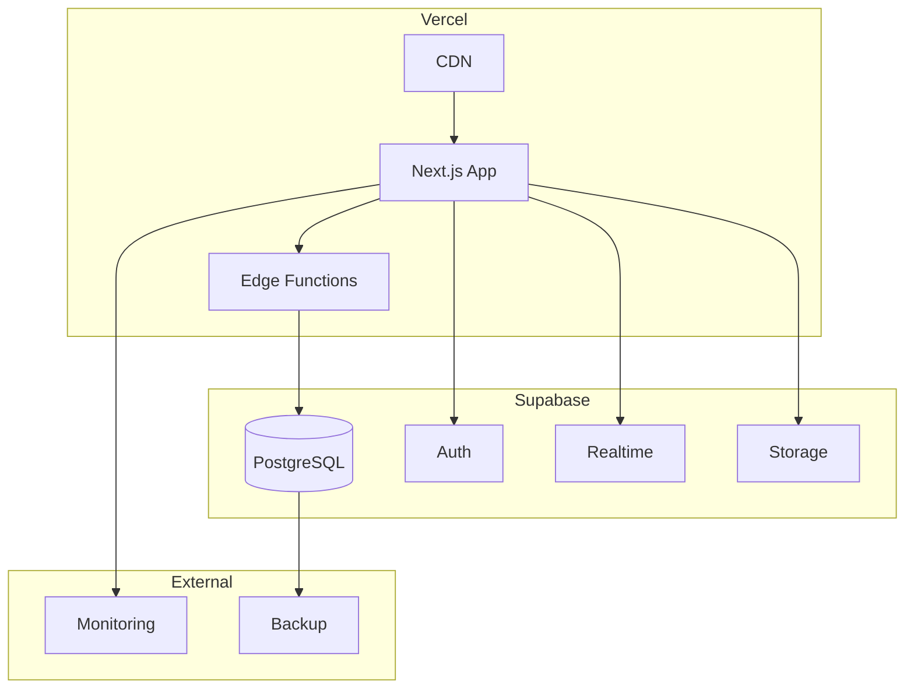

# デプロイメント戦略

## 概要
結婚式クイズアプリの本番環境へのデプロイメント戦略、環境構成、リリースプロセスを定義します。

## 環境構成

### 環境の種類
```yaml
environments:
  development:
    purpose: 開発・デバッグ
    url: http://localhost:3000
    database: Supabase（開発プロジェクト）
    
  staging:
    purpose: 本番前テスト・リハーサル
    url: https://wedding-quiz-staging.vercel.app
    database: Supabase（ステージングプロジェクト）
    
  production:
    purpose: 本番環境（結婚式当日）
    url: https://wedding-quiz.vercel.app
    database: Supabase（本番プロジェクト）
```

### インフラ構成


## デプロイメントプロセス

### 1. 事前準備

#### 環境変数の設定
```bash
# .env.production
NEXT_PUBLIC_SUPABASE_URL=https://xxxxx.supabase.co
NEXT_PUBLIC_SUPABASE_ANON_KEY=eyJhbGc...
SUPABASE_SERVICE_ROLE_KEY=eyJhbGc...
ADMIN_PASSWORD=secure_wedding_2024_password
NEXT_PUBLIC_APP_URL=https://wedding-quiz.vercel.app
QR_SECRET_KEY=wedding_qr_secret_2024
NEXT_PUBLIC_WEDDING_DATE=2024-06-15
NEXT_PUBLIC_VENUE_NAME=ホテル東京
```

#### Vercel設定
```json
// vercel.json
{
  "framework": "nextjs",
  "buildCommand": "npm run build",
  "outputDirectory": ".next",
  "installCommand": "npm ci",
  "regions": ["hnd1"], // 東京リージョン
  "functions": {
    "app/api/*": {
      "maxDuration": 10
    }
  },
  "headers": [
    {
      "source": "/(.*)",
      "headers": [
        {
          "key": "X-Content-Type-Options",
          "value": "nosniff"
        },
        {
          "key": "X-Frame-Options",
          "value": "DENY"
        },
        {
          "key": "X-XSS-Protection",
          "value": "1; mode=block"
        }
      ]
    }
  ]
}
```

### 2. ビルド＆デプロイ

#### 自動デプロイ設定
```yaml
# .github/workflows/deploy.yml
name: Deploy to Production

on:
  push:
    branches: [main]
  workflow_dispatch:

jobs:
  test:
    runs-on: ubuntu-latest
    steps:
      - uses: actions/checkout@v3
      
      - name: Setup Node.js
        uses: actions/setup-node@v3
        with:
          node-version: '20'
          cache: 'npm'
      
      - name: Install dependencies
        run: npm ci
      
      - name: Run tests
        run: npm test
      
      - name: Type check
        run: npm run type-check
      
      - name: Lint
        run: npm run lint

  deploy:
    needs: test
    runs-on: ubuntu-latest
    if: github.ref == 'refs/heads/main'
    
    steps:
      - uses: actions/checkout@v3
      
      - name: Deploy to Vercel
        uses: vercel/action@v28
        with:
          vercel-token: ${{ secrets.VERCEL_TOKEN }}
          vercel-org-id: ${{ secrets.VERCEL_ORG_ID }}
          vercel-project-id: ${{ secrets.VERCEL_PROJECT_ID }}
          vercel-args: '--prod'
```

#### 手動デプロイコマンド
```bash
# Vercel CLIによるデプロイ
npm install -g vercel

# プレビューデプロイ
vercel

# 本番デプロイ
vercel --prod

# 特定環境へのデプロイ
vercel --prod --env production
```

### 3. データベース準備

#### Supabaseマイグレーション
```sql
-- migrations/001_initial_schema.sql
-- テーブル作成
CREATE TABLE IF NOT EXISTS users (
  id UUID PRIMARY KEY DEFAULT uuid_generate_v4(),
  name VARCHAR(100) NOT NULL,
  qr_code VARCHAR(500) UNIQUE,
  group_type VARCHAR(10) CHECK (group_type IN ('bride', 'groom')),
  table_number INTEGER,
  created_at TIMESTAMP WITH TIME ZONE DEFAULT NOW()
);

CREATE TABLE IF NOT EXISTS questions (
  id SERIAL PRIMARY KEY,
  question_text TEXT NOT NULL,
  image_url TEXT,
  order_num INTEGER NOT NULL,
  time_limit INTEGER DEFAULT 30,
  is_active BOOLEAN DEFAULT false,
  created_at TIMESTAMP WITH TIME ZONE DEFAULT NOW()
);

CREATE TABLE IF NOT EXISTS choices (
  id SERIAL PRIMARY KEY,
  question_id INTEGER REFERENCES questions(id) ON DELETE CASCADE,
  choice_text TEXT NOT NULL,
  is_correct BOOLEAN DEFAULT false,
  order_num INTEGER NOT NULL
);

CREATE TABLE IF NOT EXISTS answers (
  id UUID PRIMARY KEY DEFAULT uuid_generate_v4(),
  user_id UUID REFERENCES users(id) ON DELETE CASCADE,
  question_id INTEGER REFERENCES questions(id) ON DELETE CASCADE,
  choice_id INTEGER REFERENCES choices(id),
  answered_at TIMESTAMP WITH TIME ZONE DEFAULT NOW(),
  UNIQUE(user_id, question_id)
);

CREATE TABLE IF NOT EXISTS game_state (
  key VARCHAR(50) PRIMARY KEY,
  value JSONB NOT NULL,
  updated_at TIMESTAMP WITH TIME ZONE DEFAULT NOW()
);

-- 初期データ投入
INSERT INTO game_state (key, value) VALUES
  ('current_question', '{"id": null, "status": "waiting"}'),
  ('game_status', '{"started": false, "ended": false}'),
  ('settings', '{"allow_late_join": true, "show_rankings": true}');

-- RLSポリシー設定
ALTER TABLE users ENABLE ROW LEVEL SECURITY;
ALTER TABLE questions ENABLE ROW LEVEL SECURITY;
ALTER TABLE answers ENABLE ROW LEVEL SECURITY;

-- 参加者用ポリシー
CREATE POLICY "Users can view own data" ON users
  FOR SELECT USING (auth.uid()::text = id::text);

CREATE POLICY "Public can view questions" ON questions
  FOR SELECT USING (is_active = true);

CREATE POLICY "Users can insert own answers" ON answers
  FOR INSERT WITH CHECK (auth.uid()::text = user_id::text);
```

#### データ投入スクリプト
```typescript
// scripts/seed-data.ts
import { createClient } from '@supabase/supabase-js';

const supabase = createClient(
  process.env.SUPABASE_URL!,
  process.env.SUPABASE_SERVICE_KEY!
);

async function seedData() {
  // 参加者データ投入
  const participants = [
    { name: '山田太郎', group_type: 'bride', table_number: 1 },
    { name: '鈴木花子', group_type: 'groom', table_number: 2 },
    // ... 60名分
  ];
  
  for (const participant of participants) {
    const { data: user } = await supabase
      .from('users')
      .insert(participant)
      .select()
      .single();
    
    // QRコード生成
    const qrData = {
      userId: user.id,
      eventId: 'wedding_2024',
      timestamp: Date.now(),
    };
    
    const qrCode = await generateQRCode(qrData);
    
    await supabase
      .from('users')
      .update({ qr_code: qrCode })
      .eq('id', user.id);
  }
  
  // クイズデータ投入
  const questions = [
    {
      question_text: '新郎新婦が初めて出会った場所は？',
      choices: [
        { choice_text: '大学', is_correct: true },
        { choice_text: '職場', is_correct: false },
        { choice_text: '友人の紹介', is_correct: false },
        { choice_text: '趣味のサークル', is_correct: false }
      ]
    },
    // ... 10問分
  ];
  
  for (let i = 0; i < questions.length; i++) {
    const { choices, ...questionData } = questions[i];
    
    const { data: question } = await supabase
      .from('questions')
      .insert({ ...questionData, order_num: i + 1 })
      .select()
      .single();
    
    for (let j = 0; j < choices.length; j++) {
      await supabase
        .from('choices')
        .insert({
          ...choices[j],
          question_id: question.id,
          order_num: j + 1
        });
    }
  }
  
  console.log('✅ Data seeding completed');
}

seedData().catch(console.error);
```

## リリース手順

### 1週間前
```bash
# ステージング環境構築
vercel --env staging

# データ投入
npm run seed:staging

# QRコード生成・印刷
npm run generate:qrcodes

# 負荷テスト実施
npm run test:load
```

### 3日前
```bash
# 本番環境構築
vercel --prod

# 本番データ投入
npm run seed:production

# 動作確認
npm run test:e2e:production

# バックアップ設定確認
npm run backup:test
```

### 前日
```bash
# 最終確認
npm run preflight:check

# 監視設定
npm run monitoring:setup

# 緊急連絡先確認
cat EMERGENCY_CONTACTS.md
```

### 当日朝
```bash
# システム状態確認
npm run health:check

# キャッシュクリア
npm run cache:clear

# リアルタイム接続テスト
npm run test:realtime

# バックアップ実行
npm run backup:create
```

## 監視とアラート

### 監視項目
```typescript
// monitoring/config.ts
export const monitoringConfig = {
  // アップタイム監視
  uptime: {
    url: 'https://wedding-quiz.vercel.app/api/health',
    interval: 60, // 1分ごと
    timeout: 5000,
  },
  
  // パフォーマンス監視
  performance: {
    thresholds: {
      responseTime: 1000, // 1秒
      errorRate: 0.01, // 1%
      availability: 0.99, // 99%
    }
  },
  
  // リソース監視
  resources: {
    database: {
      connections: 50, // 最大接続数
      queryTime: 100, // ms
    },
    memory: {
      usage: 0.8, // 80%
    }
  },
  
  // アラート設定
  alerts: {
    channels: ['slack', 'email'],
    recipients: ['admin@example.com'],
    conditions: {
      downtime: 60, // 1分以上のダウン
      highErrorRate: 0.05, // 5%以上のエラー
      slowResponse: 3000, // 3秒以上のレスポンス
    }
  }
};
```

### ヘルスチェックエンドポイント
```typescript
// app/api/health/route.ts
export async function GET() {
  const checks = {
    app: 'ok',
    database: 'unknown',
    realtime: 'unknown',
    timestamp: new Date().toISOString(),
  };
  
  try {
    // データベース接続確認
    const { error: dbError } = await supabase
      .from('game_state')
      .select('key')
      .limit(1);
    
    checks.database = dbError ? 'error' : 'ok';
    
    // リアルタイム接続確認
    const channel = supabase.channel('health-check');
    const connected = await new Promise(resolve => {
      channel.subscribe((status) => {
        resolve(status === 'SUBSCRIBED');
      });
      
      setTimeout(() => resolve(false), 3000);
    });
    
    checks.realtime = connected ? 'ok' : 'error';
    channel.unsubscribe();
    
  } catch (error) {
    console.error('Health check error:', error);
  }
  
  const isHealthy = Object.values(checks)
    .filter(v => typeof v === 'string')
    .every(v => v === 'ok');
  
  return Response.json(checks, {
    status: isHealthy ? 200 : 503
  });
}
```

## トラブルシューティング

### 緊急時対応

#### 1. サービス停止時
```bash
# 1. 状態確認
curl https://wedding-quiz.vercel.app/api/health

# 2. Vercel ステータス確認
vercel logs --prod

# 3. ロールバック（必要時）
vercel rollback

# 4. キャッシュクリア
vercel env pull
vercel redeploy --force
```

#### 2. データベース障害時
```bash
# 1. Supabase ステータス確認
curl https://xxxxx.supabase.co/health

# 2. 接続プール確認
psql $DATABASE_URL -c "SELECT count(*) FROM pg_stat_activity;"

# 3. 緊急メンテナンスモード
vercel env add MAINTENANCE_MODE true

# 4. バックアップからの復旧
pg_restore -d $DATABASE_URL backup.dump
```

#### 3. 高負荷時
```typescript
// 緊急負荷軽減モード
export async function enableEmergencyMode() {
  // リアルタイム更新の間隔を延長
  await updateGameState({
    realtime_interval: 5000, // 5秒に延長
    cache_ttl: 60000, // キャッシュ時間延長
    disable_animations: true,
  });
  
  // 不要な機能を無効化
  await disableFeatures([
    'live_rankings',
    'animations',
    'sound_effects'
  ]);
  
  // CDNキャッシュを最大化
  await updateCDNRules({
    cache_control: 'public, max-age=3600'
  });
}
```

## チェックリスト

### デプロイ前
- [ ] 全テスト合格
- [ ] 環境変数設定完了
- [ ] データベースマイグレーション完了
- [ ] QRコード生成・印刷完了
- [ ] 負荷テスト実施
- [ ] バックアップ設定確認
- [ ] 監視設定完了
- [ ] 緊急連絡先リスト更新

### 当日
- [ ] システムヘルスチェック
- [ ] ネットワーク接続確認
- [ ] プロジェクター接続テスト
- [ ] 音響システム確認
- [ ] 予備機器準備
- [ ] オペレーター配置確認
- [ ] 緊急時手順書配布